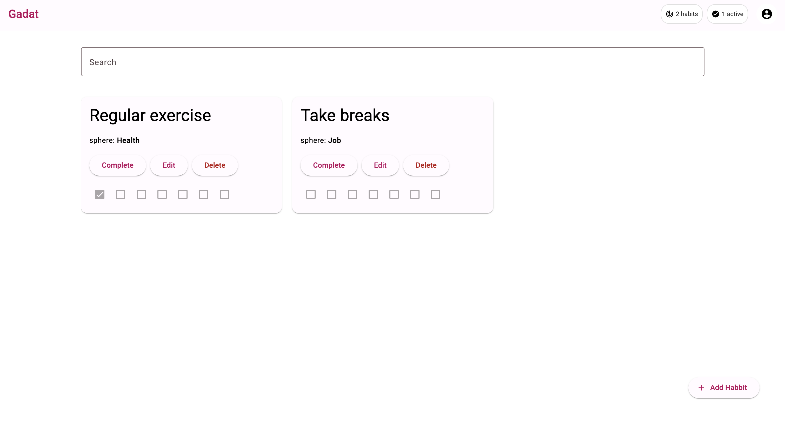

# 🎯 Gadat - Personal Habit Tracker



> A modern Angular application for tracking daily habits

## 🛠️ Technologies

[](https://angular.io/)
[](https://www.typescriptlang.org/)
[](https://material.angular.io/)

## ✨ Features

### 🔐 **Authentication System**
- Simple login and registration with form validation
- Session management with 24-hour expiry
- Password encoding and user credentials storage

### 📋 **Habit Management**
- **Create** new habits with categorization (Health, Job, Relationship)
- **Track** daily progress with visual sprint indicators
- **Edit** existing habits with form validation
- **Delete** individual or all habits
- **Search** habits by name with real-time filtering
- **Complete** habits with date tracking

### 🎨 **Modern UI/UX**
- Angular Material Design components
- Responsive design for desktop and mobile
- Real-time search with loading indicators
- User statistics in the toolbar

### 🛡️ **Route Protection & Guards**
- **Auth Guard**: Protects authenticated routes
- **Can Deactivate Guard**: Prevents data loss on navigation
- **Habit Exists Guard**: Validates habit existence before editing

### ⚡ **Performance Optimizations**
- Lazy loading for all major modules
- OnPush change detection strategy
- Angular Signals for reactive state management
- Efficient component architecture

## 🏗️ Architecture

### 📁 **Project Structure**
```
src/app/
├── layout/                     # Main app layout
├── modules/
│   ├── auth/                   # Authentication module
│   │   ├── components/login/   # Login & registration
│   │   ├── guards/            # Auth guard
│   │   ├── models/            # User & auth interfaces
│   │   └── services/          # Authentication service
│   ├── habits/                # Habits module
│   │   ├── components/        # Habit components
│   │   ├── guards/            # Route guards
│   │   ├── models/            # Habit interfaces
│   │   └── services/          # Habit service
│   └── home/                  # Home module
└── app.routes.ts              # Lazy-loaded routes
```

### 🔧 **Tech Stack**
- **Framework**: Angular 18.1.4
- **UI Library**: Angular Material 18.1.4
- **State Management**: Angular Signals
- **Routing**: Angular Router with Guards
- **Forms**: Reactive Forms with Validation
- **Testing**: Jasmine + Karma
- **Code Quality**: ESLint + Prettier + Husky

### 🎯 **Core Services**

#### AuthService
- User authentication and session management
- Local storage for credentials and sessions
- Signal-based reactive state
- Session expiry handling

#### HabitService
- CRUD operations for habits
- User-specific habit filtering
- Search functionality
- Progress tracking and statistics

## 🚀 Getting Started

### Prerequisites
- Node.js (v18 or higher)
- npm or yarn
- Angular CLI

### Installation
```bash
# Clone the repository
git clone <repository-url>
cd Gadat

# Install dependencies
npm install

# Start development server
npm start
```

### Development Commands
```bash
# Start development server
npm start                # Runs on http://localhost:4200

# Run tests
npm test                # Unit tests with Karma

# Build for production
npm run build           # Creates dist/ folder

# Code quality
npm run lint            # ESLint checking
npm run lint:fix        # Auto-fix ESLint issues
npm run prettier        # Format code with Prettier
```

## 🎮 Usage

### Getting Started
1. **Navigate** to `http://localhost:4200`
2. **Login** with demo credentials:
   - Username: `admin`
   - Password: `password`
3. **Create** your first habit
4. **Track** your daily progress

### Demo Credentials
For testing purposes, use:
- **Username**: `admin`
- **Password**: `password`

Or create a new account using the registration tab.

## 🧪 Testing

The application includes comprehensive test coverage:

- **Unit Tests**: Component and service testing with Jasmine
- **Authentication Tests**: Login/registration flows
- **Habit Service Tests**: CRUD operations and business logic
- **Guard Tests**: Route protection validation

```bash
# Run all tests
npm test

# Run tests with coverage
npm run test -- --code-coverage
```

## 🔒 Security Features

- Password encoding for stored credentials
- Session-based authentication with expiry
- Route guards preventing unauthorized access
- User-specific data isolation
- Form validation and input sanitization

## 📱 Responsive Design

- Mobile-first approach
- Flexible grid layouts
- Touch-friendly interfaces
- Adaptive navigation
- Material Design principles

## 🛠️ Development Highlights

### Modern Angular Patterns
- **Standalone Components**: No NgModules required
- **Angular Signals**: Reactive state management
- **Inject Function**: Dependency injection
- **OnPush Strategy**: Optimized change detection

### Code Quality
- **ESLint**: Code linting and best practices
- **Prettier**: Consistent code formatting
- **Husky**: Git hooks for pre-commit validation
- **TypeScript**: Strong typing throughout

